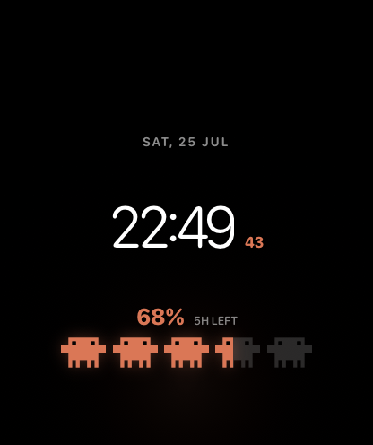
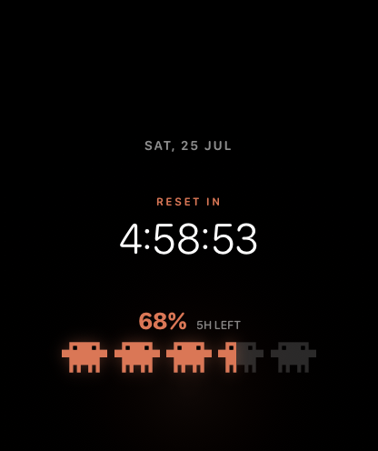
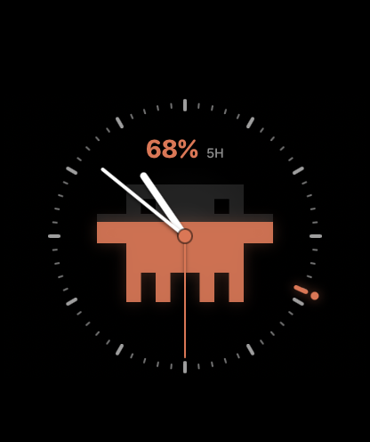

# Claude Credits Watch

A standalone SwiftUI watchOS prototype for visualizing the remaining Claude
five-hour allowance. It currently uses mock values and includes two full-screen,
face-like designs:

- **Five aliens:** a digital clock with five segmented pixel aliens along the
  bottom. Each alien represents 20% of the monthly allowance.
- **Analog drain:** a quiet analog clock with one large alien that drains
  vertically as the remaining allowance falls. An orange bezel marker shows
  the reset time.

| Digital clock | Reset countdown | Analog reset marker |
| --- | --- | --- |
|  |  |  |

> Apple does not let third-party developers install fully custom system watch
> faces. This project is a watchOS app that behaves like a face while it is
> open. A later WidgetKit complication can put the credit status on an actual
> Apple watch face, but the complete custom layouts must remain inside the app.

## Run it

1. Install the full Xcode app from the Mac App Store.
2. Open `ClaudeCreditsWatch.xcodeproj`.
3. Select the `ClaudeCreditsWatch` scheme and an Apple Watch simulator.
4. Set your development team under **Signing & Capabilities** if you want to
   install it on your own watch.
5. Run the app.

This Mac is configured with Xcode 26.6 and the watchOS 26.5 platform.

The committed Xcode project is generated from `project.yml`. To regenerate it:

```sh
brew install xcodegen
xcodegen generate
```

## Prototype controls

- Rotate the Digital Crown to change the mocked remaining percentage.
- Double-tap anywhere to switch between the two designs.
- Tap the digital time to switch between the clock and reset countdown.
- Long-press anywhere to open controls with a slider and preset values.

The controls also provide one-, three-, and five-hour reset presets. The
percentage and reset timestamp are the seams for replacing local values with
Claude Code's official five-hour rate-limit snapshot later.

## Branding

The Clawd mascot grid is adapted from
`~/Git/clawd-invaders/assets/alien-pose-1.svg`, using the same warm
terra-cotta palette.

The app hides watchOS's system clock with the SDK's underscored
`_statusBarHidden()` modifier. That choice is appropriate for this personal
sideloaded prototype, but should be revisited before any App Store submission.
